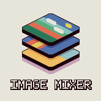
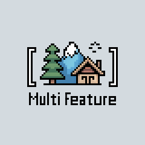

<div align="center">
  
</div>

<p align="left">
  <a href="https://github.com/thePixelmancer/regolith-filters"></a>
  <a href="./LICENSE"></a>
  <a href="https://github.com/Bedrock-OSS/regolith"></a>
</p>

A curated collection of **custom Regolith filters** for Minecraft Bedrock Edition development. These filters help automate common tasks, streamline workflows, and enhance your Bedrock Edition project development experience.

> 🚀 **Ready to supercharge your Minecraft development?** Each filter is designed to solve real problems that Bedrock Edition developers face daily.

# 📦 Available Filters

|                                                                     | Link                                    | Short Description                                                                     |
| ------------------------------------------------------------------- | --------------------------------------- | ------------------------------------------------------------------------------------- |
| 🎨                                                                  | [Aseprite Convert](./aseprite_convert/) | Convert Aseprite files into PNGs in multiple modes, including spritesheets and atlas. |
| 📚                                                                  | [Addon Docs](./addon_docs/)             | Generate Markdown documentation for Minecraft Bedrock addons from templates and data. |
| 🥚                                                                  | [Auto Spawn Egg](./auto_spawn_egg/)     | Auto-generate spawn egg colors for custom entities based on dominant texture colors.  |
| 📦                                                                  | [Fetcher](./fetcher/)                   | Download files or folders from GitHub into your Minecraft project.                    |
|   | [Image Mixer](./image_mixer/)           | Batch-generate composite images from layered PNGs with advanced positioning/scaling.  |
| 🌐                                                                  | [MCLocalize](./mclocalize/)             | Manage localization files for multiple languages in Bedrock Edition.                  |
| 🔄                                                                  | [Replacements](./replacements/)         | Perform project-wide intelligent string replacements for identifiers and namespaces.  |
| 🗃️                                                                  | [Jsonify](./jsonify/)                   | Convert YAML, JSON5, JSONC, and TOML files to JSON recursively.                       |
|  | [MultiFeature](./multifeature/)         | Combine multiple feature definitions in one file and split into .json during build.   |
| 🍳                                                                  | [Recipe Image Gen](./recipe_image_gen/) | Generate recipe images automatically from crafting recipe definitions.                |

---

_Detailed filter documentation, installation guides, and configuration examples are provided below._

## 🚀 Quick Start

### Installation

Each filter can be installed individually using Regolith:

```bash
# Install specific filters by folder name
regolith install aseprite_convert
regolith install addon_docs
regolith install auto_spawn_egg
regolith install fetcher
regolith install image_mixer
regolith install mclocalize
regolith install replacements
regolith install jsonify
regolith install multifeature
regolith install recipe_image_gen
```

### Usage

Add filters to your Regolith profile in `config.json`:

```json
{
  "regolith": {
    "profiles": {
      "default": {
        "filters": [
          {
            "filter": "filter-name",
            "settings": {
              // Filter-specific configuration
            }
          }
        ]
      }
    }
  }
}
```

## 📋 Requirements

### General Requirements

- [Regolith](https://github.com/Bedrock-OSS/regolith) - Bedrock Edition development framework
- Python 3.7+ (for Python-based filters)

### Filter-Specific Requirements

- **Addon Docs**: [Deno](https://deno.com/)
- **Aseprite Convert**: [Aseprite](https://aseprite.org/) software
- **Auto Spawn Egg**: `colorthief` Python library
- **Image Mixer**: `Pillow` (PIL) Python library
- **Fetcher**: `requests` Python library
- **Jsonify**: `ruamel.yaml`, `json5`, `tomllib` Python libraries
- **MCLocalize**: `translators` Python library
- **Recipe Image Gen**: `Pillow` (PIL), `reticulator` Python libraries

Install Python dependencies:

```bash
pip install colorthief pillow requests ruamel.yaml json5 translators reticulator
```

## 🤝 Contributing

Contributions are welcome! Whether you want to:

- 🐛 Report bugs
- 💡 Suggest new features
- 🔧 Submit pull requests
- 📚 Improve documentation

Please feel free to open an issue or submit a pull request.

### Development Guidelines

1. Each filter should be self-contained in its own directory
2. Include comprehensive README documentation
3. Provide example configurations and test cases
4. Follow Python best practices for code quality
5. Test thoroughly with various Minecraft project setups

## 🌟 Why Choose These Filters?

- ✅ **Production-Ready**: Battle-tested in real Minecraft projects
- 🔧 **Easy Integration**: Simple installation and configuration
- 📚 **Comprehensive Docs**: Detailed documentation and examples
- 🎯 **Focused Solutions**: Each filter solves specific development challenges
- 🤝 **Community-Driven**: Open source with active community support

---

## 📄 License

This project is licensed under the MIT License - see the [LICENSE](LICENSE) file for details.

## 🙏 Acknowledgments

- Thanks to the [Regolith](https://github.com/Bedrock-OSS/regolith) team for creating an amazing development framework
- The Minecraft Bedrock Edition community for inspiration and feedback
- Contributors who help improve and maintain these filters

## 📞 Support

If you encounter issues or need help:

1. Check the individual filter README files for specific documentation
2. Search existing [GitHub issues](https://github.com/thePixelmancer/regolith-filters/issues)
3. Create a new issue with detailed information about your problem

---

⭐ **Star this repository if you find these filters helpful!** ⭐
